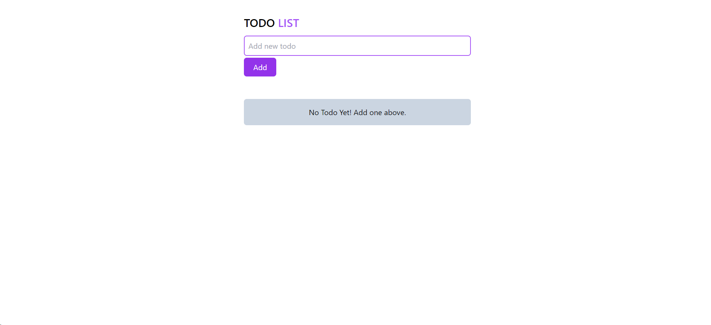
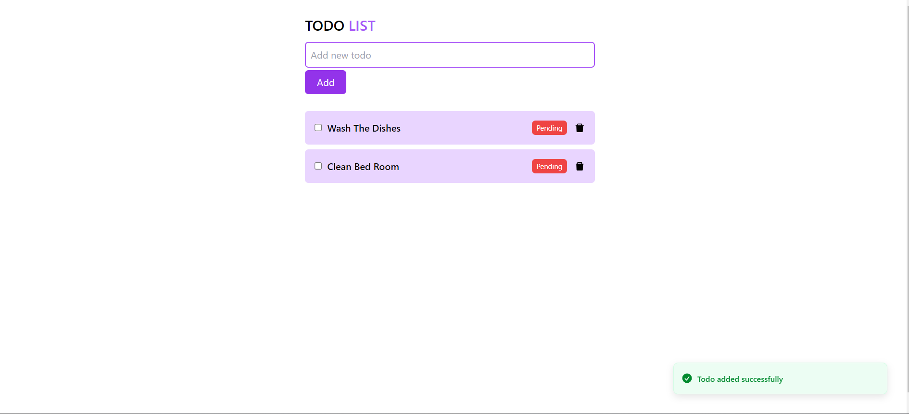
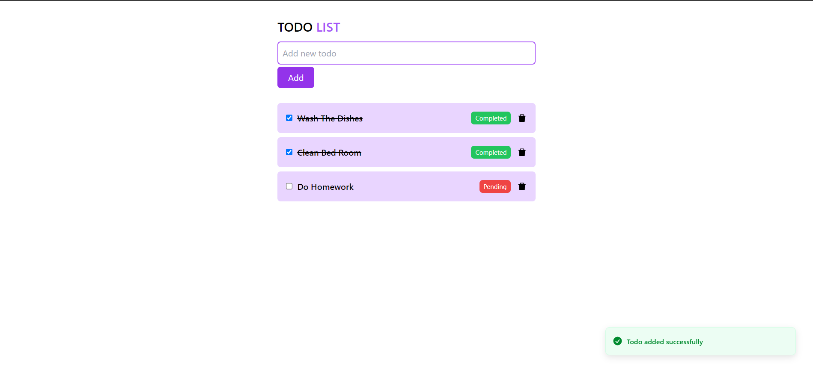

# Todo-App
Day one of one hundred days of coding, this is a todo app that allows users to perform all the CRUD operations on todos

Users can add new todos
Delete Todos and  mark them as completed.

## Getting Started
These instructions will get you a copy of the project up and running on your local machine for development and testing purposes.

First fork the repo.

Clone the repository by using this command in your terminal:
bash$ git clone https://github.com/mohamedelzarei/Todo-app.git

Open the project folder with any text editor or IDE 

Cd to  the cloned directory $ cd Todo-app

Install all dependencies by running npm install from your terminal inside the project folder

Run $ npm run dev, this would start the app at http://localhost:5173

Don't forget to star this repo if you found it helpful

## App images

